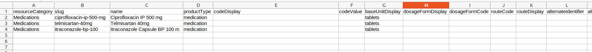
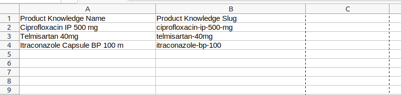
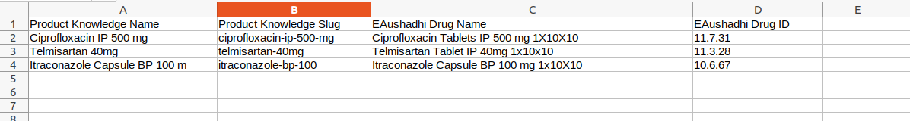
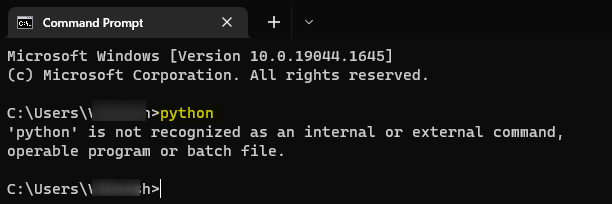
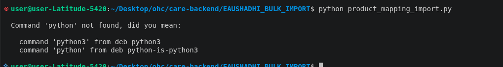
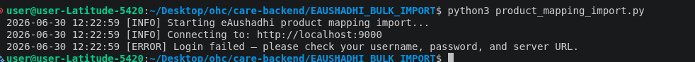
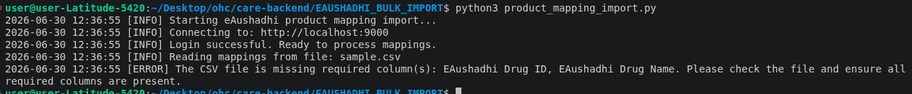
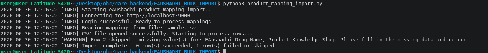
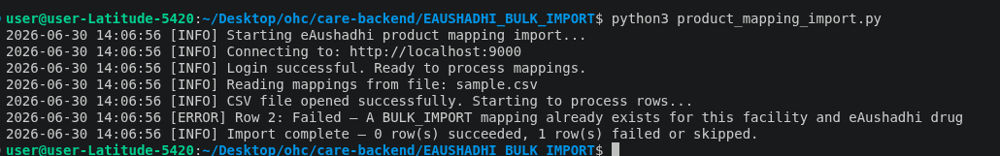
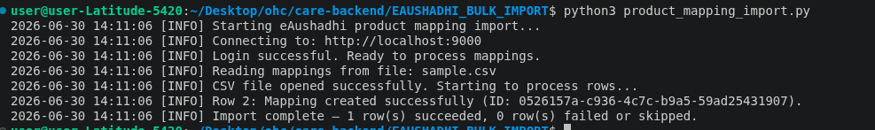

# Product Mapping Bulk Import — User Guide

This guide helps you bulk-upload product mappings into CARE using a spreadsheet (CSV file). No programming knowledge is needed — just follow the steps below one by one.

<br />


## System Requirements

- A Windows, Mac, or Linux computer with internet access
- Your CARE admin username and password
- The list of products you want to map, ready in a spreadsheet
- The **`care_imports_fe`** plugin installed on your CARE instance (required to export the Product Knowledge list)

<br />

## Step 1 — Download and Install Python

Python is a free program that runs the import script. You only need to install it once.

### On Windows

1. Open your web browser and go to: **https://www.python.org/downloads/**
2. Click the big yellow **"Download Python 3.x.x"** button.
3. Once the file downloads, double-click it to open the installer.
4. **Important:** On the very first screen of the installer, tick the checkbox that says **"Add Python to PATH"** at the bottom. Do this before clicking anything else.
5. Click **"Install Now"** and wait for it to finish.
6. Click **"Close"** when done.

### On Mac

1. Open your web browser and go to: **https://www.python.org/downloads/**
2. Click the big yellow **"Download Python 3.x.x"** button.
3. Once the file (ending in `.pkg`) downloads, double-click it.
4. Follow the on-screen steps — keep clicking **"Continue"** and then **"Install"**.
5. Enter your Mac password if asked, then click **"Close"** when done.

<br />

## Step 2 — Prepare Your Spreadsheet

Your spreadsheet must be saved as a **CSV file** (Comma Separated Values). It must have exactly these four column headings in the first row:

A ready-made `sample.csv` file is included in this folder — you can open it in Excel as a starting point.

### How to get the Product Knowledge Name and Slug

The easiest way is to download them all at once using the **`care_imports_fe`** plugin.

#### Step 2.1 — Download the Product Knowledge CSV

1. Log into CARE and go to the **Admin Dashboard**.
2. In the left sidebar, click on **Exports**.
3. Select your facility from the dropdown.
4. Click on the **Product Knowledge** tab.
5. Click **Download CSV**.

A sample of the exported CSV is included in this folder as [**`product_knowledge_export_e1ff13b6-383a-4217-a367-f421f7bbe478.csv`**](./product_knowledge_export_e1ff13b6-383a-4217-a367-f421f7bbe478.csv) for reference. When opened in Excel it looks like this:

| resourceCategory | slug | name | productType | … |
|------------------|------|------|-------------|---|
| Medications | ciprofloxacin-ip-500-mg | Ciprofloxacin IP 500 mg | medication | … |
| Medications | telmisartan-40mg | Telmisartan 40mg | medication | … |
| Medications | itraconazole-bp-100 | Itraconazole Capsule BP 100 m | medication | … |


---

#### Step 2.2 — Extract and rename the two columns you need

You only need two columns from the downloaded file — **`slug`** and **`name`**. All other columns can be deleted.

1. Open the downloaded CSV in Excel.
2. Delete all columns **except** `slug` and `name`.
3. Rename the column headers:
   - `name` → **`Product Knowledge Name`**
   - `slug` → **`Product Knowledge Slug`**
4. Reorder so **Product Knowledge Name** is the first column and **Product Knowledge Slug** is the second.

Your sheet should now look like this:

| Product Knowledge Name | Product Knowledge Slug |
| ---------------------- | ---------------------- |
| Ciprofloxacin IP 500 mg | ciprofloxacin-ip-500-mg |
| Telmisartan 40mg | telmisartan-40mg |
| Itraconazole Capsule BP 100 m | itraconazole-bp-100 |




---

#### Step 2.3 — Fill in the eAushadhi Drug Name and Drug ID

Add two more columns to the right: **`EAushadhi Drug Name`** and **`EAushadhi Drug ID`**. For each row, fill in the matching drug name and drug ID from the eAushadhi system.

Your completed spreadsheet should look like this:

| Product Knowledge Name | Product Knowledge Slug | EAushadhi Drug Name | EAushadhi Drug ID |
| ---------------------- | ---------------------- | ------------------- | ----------------- |
| Telmisartan 40mg | telmisartan-40mg | Telmisartan Tablet IP 40mg 1x10x10 | 11.3.28 |



> **Tip:** When saving in Excel, go to **File → Save As** and choose **"CSV (Comma delimited)"** from the file type dropdown.

Once saved, copy the CSV file into the same folder as `product_mapping_import.py`. Then open `product_mapping_import.py` in Notepad and update the `CSV_FILE` line to match your file's name. For example, if you saved your file as `my_mappings.csv`:

```
CSV_FILE = "my_mappings.csv"
```

<br />

## Step 3 — Edit the Script Settings

Before running the script, you need to tell it your CARE website address, your login details, and the facility you are importing for.

1. Open the file **`product_mapping_import.py`** in Notepad (right-click the file → "Open with" → Notepad).
2. Near the top of the file you will see these lines:

   ```
   BASE_URL    = "http://localhost:9000"
   USERNAME    = "admin"
   PASSWORD    = "admin"
   FACILITY_ID = "your-facility-id"
   CSV_FILE    = "sample.csv"
   ```

3. Replace the placeholder values inside the quotes with your actual details. For example:

   ```
   BASE_URL    = "https://care.yourhospital.org"
   USERNAME    = "admin"
   PASSWORD    = "yourpassword"
   FACILITY_ID = "e1ff13b6-383a-4217-a367-f421f7bbe478"
   CSV_FILE    = "sample.csv"
   ```

4. Save the file (Ctrl + S on Windows, Cmd + S on Mac).

### How to find your Facility ID

1. Log into CARE with your username and password.
2. From the home page, click on the facility you want to configure.
3. Look at the address bar of your browser. The URL will look something like:
   `.../facility/e1ff13b6-383a-4217-a367-f421f7bbe478/overview`
4. The long code between `facility/` and `/overview` is your Facility ID — for example, `e1ff13b6-383a-4217-a367-f421f7bbe478`.
5. Copy it and paste it as the value of `FACILITY_ID` in the script.

<br />

## Step 4 — Place Your CSV File in the Folder

Copy your completed CSV file into the same folder as `product_mapping_import.py`. If your file is named something other than `sample.csv`, update the `CSV_FILE` line in the script (Step 3) to match your file name.

<br />

## Step 5 — Run the Script

### On Windows

1. Open the folder containing `product_mapping_import.py`.
2. Click on the address bar at the top of the folder window (where the folder path is shown), type `cmd`, and press **Enter**. A black window (Command Prompt) will open.
3. Type the following and press **Enter**:
   ```
   pip install requests
   ```
   Wait for it to finish.
4. Then type the following and press **Enter**:
   ```
   python product_mapping_import.py
   ```

### On Mac

1. Open the **Terminal** app (you can find it by searching "Terminal" in Spotlight — press Cmd + Space).
2. Drag the folder containing `product_mapping_import.py` into the Terminal window. The folder path will appear. Add `cd ` at the beginning so it looks like `cd /path/to/folder`, then press **Enter**.
3. Type the following and press **Enter**:
   ```
   pip3 install requests
   ```
   Wait for it to finish.
4. Then type the following and press **Enter**:
   ```
   python3 product_mapping_import.py
   ```

<br />

## What Happens When You Run It

- The script reads your CSV file row by row and uploads each product mapping to CARE.
- If a row has missing information, it is skipped and a warning is shown — the rest of the rows still get processed.
- At the end, a summary is shown telling you how many rows were uploaded successfully and how many were skipped or had errors.

<br />

## Difference case scenarios that might occur while running the script


### `python` is not recognised

**For windows:**



**For Mac:**




**Solution:**

Replace `python` with `python3` and try again:

```
python3 product_mapping_import.py
```

**NOTE:** In case the issue persists, there might be some issue in the installation. Try re-installing and follow the exact steps mentioned in Step 1.

---

### Login failed



**Solution:**
Open `product_mapping_import.py` in Notepad and double-check that `BASE_URL`, `USERNAME`, and `PASSWORD` are correct, with no extra spaces.

**NOTE:** Ensure there is no slash at the end of the `BASE_URL`.

---

### CSV columns not recognised

| Product Knowledge Name | Product Knowledge Slug | drug name | id |
| - | - | - | - |
| Telmisartan 40mg | f-e1ff13b6-383a-4217-a367-f421f7bbe478-telmisartan-40mg | Telmisartan Tablet IP 40mg 1x10x10 | 11.3.28



A column heading in your CSV is missing or misspelled. Open it in Excel and make sure the first row has all four headings spelled exactly as shown in Step 2.

---

### A row was skipped




**Solution:**

That row in your CSV has empty cells. Open the CSV in Excel, fill in the missing values for that row, save, and run the script again.

---

### A row could not be uploaded



```
[ERROR] Row 6: Failed — <reason>
```

CARE rejected this row. The reason is shown at the end of the line.

Common causes:

| Reason in terminal | What to do |
|--------------------|------------|
| `Cannot read product knowledge` | The credentials are valid but not admin credentials. Use the admin credentials (Step 3) |
| `Input should be a valid UUID …` | The `FACILITY_ID` in the script is not a valid facility id. Use a valid facility ID (Step 3) |
| `No Facility matches the given query` | The `FACILITY_ID` in the script is not a valid facility id. Use a valid facility ID (Step 3) |
| `No ProductKnowledge matches the given query.` | Check that the slug in your CSV matches one from the exported Product Knowledge CSV for your facility. |
| ` A BULK_IMPORT mapping already exists for this facility and eAushadhi drug` | This eAushadhi drug is already mapped for this facility. You can skip this row. |

---

### Everything worked

All rows were uploaded successfully. 


